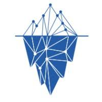
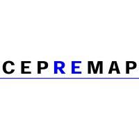
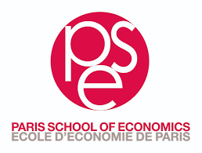

My academic journey started with economics, but curiosity led me to explore the technical side of things.

I started coding during COVID lockdown, and I never stopped since then.

This exploration has not only broadened my understanding but also shaped my career path in unexpected ways. Coding has become a significant part of my life, with Python being my go-to language, although I occasionally venture into TypeScript and Rust for specific projects.

My professional experience includes working with Docker and Kubernetes, focusing on deploying applications efficiently. Recently, I've been delving into the potential of Large Language Models (LLM) for extracting data from raw text documents. This work has been both challenging and rewarding, pushing me to continuously learn and adapt. I enjoy the process of exploring new technologies and ideas, always looking for ways to improve and innovate.

If you would like a newer unredacted version of my resume or have an interesting project or opportunity you would like to share, please don't hesitate to reach out via [email](mailto:jouhameau.romain@gmail.com) or [linkedIn](https://www.linkedin.com/in/romain-jouhameau-87064618b/).

## Experience

<table>
    <thead>
        <tr>
            <th></th>
            <th>Company</th>
            <th>Role</th>
            <th>Dates</th>
            <th>Location</th>
        </tr>
    </thead>
    <tbody>
        <tr>
            <td ></td>
          <td><a href="https://www.icebergdatalab.com/" target="_blank">Iceberg Datalab</a></td>
            <td>Data Scientist</td>
            <td>Nov 2022 - Present</td>
            <td>Paris</td>
        </tr>
        <tr>
            <td ></td>
            <td><a href="https://www.cepremap.fr/" target="_blank">CEPREMAP</a></td>
            <td>Research Assistant</td>
            <td>2021 - 2022</td>
            <td>Paris</td>
        </tr>
    </tbody>
</table>

## Education

<table>
    <thead>
        <tr>
            <th></th>
            <th>School</th>
            <th>Degree</th>
            <th>Dates</th>
            <th>Location</th>
        </tr>
    </thead>
    <tbody>
        <tr>
            <td ></td>
          <td><a href="https://ecole-ipssi.com/" target="_blank">IPSSI</a></td>
            <td>M2 Dev, Data, IA</td>
            <td>2022 - 2023</td>
            <td>Paris</td>
        </tr>
        <tr>
            <td ></td>
          <td><a href="https://www.pantheonsorbonne.fr/" target="_blank">Paris 1 - Panthéon-Sorbonne</a></td>
            <td>M2 - Financial Economics</td>
            <td>2021 - 2022</td>
            <td>Paris</td>
        </tr>
        <tr>
            <td ></td>
            <td><a href="https://www.parisschoolofeconomics.eu/en/" target="_blank">PSE - Paris School of Economics</a></td>
            <td>M1 - APE</td>
            <td>2020 - 2021</td>
            <td>Paris</td>
        </tr>
    </tbody>
</table>

## Certifications

| Certification           | Provider | Year |
| ----------------------- | -------- | ---- |
| Azure Data Fundamentals | Azure    | 2021 |
|                         |          |      |

## Resume in details




Lorem ipsum dolor sit amet, consectetur adipiscing elit. Vivamus non magna ex. Donec sollicitudin ut lorem quis lobortis. Nam ac ipsum libero. Sed a ex eget ipsum tincidunt venenatis quis sed nisl. Pellentesque sed urna vel odio consequat tincidunt id ut purus. Nam sollicitudin est sed dui interdum rhoncus.



With html code

<ul>
  <li>Coffee</li>
  <li>Tea</li>
  <li>Milk</li>
</ul>



With other shortcodes






